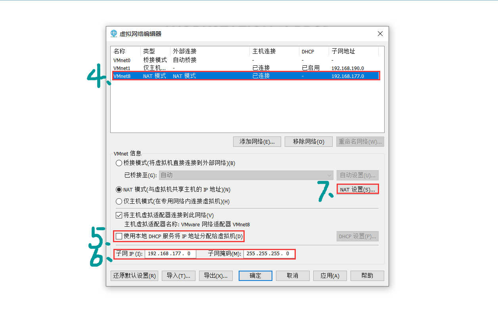

#开放端口和关闭防火墙
查看防火墙某个端口是否开放
```
sudo firewall-cmd --query-port=3306/tcp
```

开放防火墙端口3306
```
sudo firewall-cmd --zone=public --add-port=3306/tcp --permanent
```
关闭防火墙端口3306
```
sudo firewall-cmd --zone=public --remove-port=3306/tcp --permanent  #关闭3306端口
```
查看监听的端口
```
sudo netstat -lnpt
```

查看端口被占用进程
```
sudo netstat -lnpt |grep 3306
```
查看进程的详细信息
```
sudo ps 6832(进程号)
```
终止进程
```
中止进程

sudo kill -9 6832
```
配置立即生效
```
sudo firewall-cmd --reload   # 配置立即生效
```
查看防火墙状态
```
sudo systemctl status firewalld
```

关闭防火墙
```
sudo systemctl stop firewalld

```
打开防火墙
```
sudo systemctl start firewalld
```

开放一段端口
```
sudo firewall-cmd --zone=public --add-port=40000-45000/tcp --permanent
```

查看开放的端口列表
```
sudo firewall-cmd --zone=public --list-ports
```

#centos配置静态ip
####1.编辑虚拟机网卡，并查看网关
* DHCP服务关掉后使用ip addr 命令无法查看ip，于是我没有停用这个服务

（1）vmware里面点击"编辑"->"虚拟网络编辑器"





（2）进入虚拟机，编辑网卡
```
sudo vim /etc/sysconfig/network-scripts/ifcfg-ens33
```

```
TYPE=Ethernet
PROXY_METHOD=none
BROWSER_ONLY=no
BOOTPROTO=static #设置为static静态
DEFROUTE=yes
IPV4_FAILURE_FATAL=no
IPV6INIT=yes
IPV6_AUTOCONF=yes
IPV6_DEFROUTE=yes
IPV6_FAILURE_FATAL=no
IPV6_ADDR_GEN_MODE=stable-privacy
NAME=ens33
UUID=066b4926-b40c-4c28-a5b4-2310d2b96613
DEVICE=ens33
ONBOOT=yes #如果为no的话就改为yes，表示网卡设备自动启动
IPADDR=192.168.177.137 #只要在网关对应的范围ip地址即可
NETMASK=255.255.255.0 #C类默认的子网掩码：255.255.255.0
GATEWAY=192.168.177.2 #第8步对应的网关
DNS1=8.8.8.8 #DNS1域名系统用谷歌
DNS2=223.6.6.6 #DNS2域名系统用阿里
PREFIX=24
```


3.刷新网卡配置
```
sudo nmcli c reload
```
#CentOS Linux 8更换国内源（阿里源）
####1.背景
YUM是用Python2.x写成的，而DNF是用Python3.x写成的。
这样的话CentOS Linux 8把默认的Python版本改成了3.x，对应的软件包管理器也就顺理成章的从YUM改成了DNF。
所以CentOS Linux 8的默认RPM软件包管理器从YUM变成了DNF。

####2.为什么需要更换国内源
由于系统安装的包管理配置文件链接的国外的服务器，导致我们安装软件、升级内核和升级软件的时候会从国外的服务器下载相关文件。由于众所周知的原因，国外服务器的网速真的不敢恭维，所以我们要把他们替换为国内的服务器，这样安装和升级软件的速度就会提高，降低维护人员在等待上所花费的时间。
因为阿里源文件里面已经包含了AppStream、Base、centosplus、Extras和PowerTools的相关内容，所以需要把这些文件改名为bak，不让系统执行。

```
#管理员身份运行
cd /etc/yum.repos.d/
mv /etc/yum.repos.d/CentOS-AppStream.repo /etc/yum.repos.d/CentOS-AppStream.repo.bak
mv /etc/yum.repos.d/CentOS-Base.repo /etc/yum.repos.d/CentOS-Base.repo.bak
mv /etc/yum.repos.d/CentOS-centosplus.repo /etc/yum.repos.d/CentOS-centosplus.repo.bak
mv /etc/yum.repos.d/CentOS-Extras.repo /etc/yum.repos.d/CentOS-Extras.repo.bak
mv /etc/yum.repos.d/CentOS-PowerTools.repo /etc/yum.repos.d/CentOS-PowerTools.repo.bak
```
做完以上修改以后，就可以下载新的阿里源文件了，因为默认没有装wget，我们可以用curl来执行以下命令：
```
curl -o /etc/yum.repos.d/CentOS-Base.repo http://mirrors.aliyun.com/repo/Centos-8.repo
```
如果有wget也可以执行以下命令：
```
wget -O /etc/yum.repos.d/CentOS-Base.repo http://mirrors.aliyun.com/repo/Centos-8.repo
```
如果没有安装wget，运行这个命令会提示“bash: wget: 未找到命令”，那就用curl的那个命令来执行好了。或者你也可以先安装wget，很简单，只需要下面一个命令即可（前提是在将上面的文件改为“.bak”之前，如果已经改了，先改回去再执行下述命令）
```
yum -y install wget
```

查看一下是否安装完成，执行命令
```
ls -l /etc/yum.repos.d/
```

将会看到如下内容
```
-rw-r--r--. 1 root root  731 8月  14 14:42 CentOS-AppStream.repo.bak
-rw-r--r--. 1 root root 2595 12月 25 19:44 CentOS-Base.repo
-rw-r--r--. 1 root root  712 8月  14 14:42 CentOS-Base.repo.bak
-rw-r--r--. 1 root root  798 8月  14 14:42 CentOS-centosplus.repo.bak
-rw-r--r--. 1 root root 1320 8月  14 14:42 CentOS-CR.repo
-rw-r--r--. 1 root root  668 8月  14 14:42 CentOS-Debuginfo.repo
-rw-r--r--. 1 root root  756 8月  14 14:42 CentOS-Extras.repo.bak
-rw-r--r--. 1 root root  338 8月  14 14:42 CentOS-fasttrack.repo
-rw-r--r--. 1 root root  928 8月  14 14:42 CentOS-Media.repo
-rw-r--r--. 1 root root  736 8月  14 14:42 CentOS-PowerTools.repo.bak
-rw-r--r--. 1 root root 1382 8月  14 14:42 CentOS-Sources.repo
-rw-r--r--. 1 root root   74 8月  14 14:42 CentOS-Vault.repo
```
再执行以下命令查看一下内容，确认是否更改成功
```
cat /etc/yum.repos.d/CentOS-Base.repo
```
如果看到如下内容，则代表升级成功了。
```
# CentOS-Base.repo
#
# The mirror system uses the connecting IP address of the client and the
# update status of each mirror to pick mirrors that are updated to and
# geographically close to the client.  You should use this for CentOS updates
# unless you are manually picking other mirrors.
#
# If the mirrorlist= does not work for you, as a fall back you can try the 
# remarked out baseurl= line instead.
#
#
 
[base]
name=CentOS-$releasever - Base - mirrors.aliyun.com
failovermethod=priority
baseurl=https://mirrors.aliyun.com/centos/$releasever/BaseOS/$basearch/os/
        http://mirrors.aliyuncs.com/centos/$releasever/BaseOS/$basearch/os/
        http://mirrors.cloud.aliyuncs.com/centos/$releasever/BaseOS/$basearch/os/
gpgcheck=1
gpgkey=https://mirrors.aliyun.com/centos/RPM-GPG-KEY-CentOS-Official
 
#additional packages that may be useful
[extras]
name=CentOS-$releasever - Extras - mirrors.aliyun.com
failovermethod=priority
baseurl=https://mirrors.aliyun.com/centos/$releasever/extras/$basearch/os/
        http://mirrors.aliyuncs.com/centos/$releasever/extras/$basearch/os/
        http://mirrors.cloud.aliyuncs.com/centos/$releasever/extras/$basearch/os/
gpgcheck=1
gpgkey=https://mirrors.aliyun.com/centos/RPM-GPG-KEY-CentOS-Official
 
#additional packages that extend functionality of existing packages
[centosplus]
name=CentOS-$releasever - Plus - mirrors.aliyun.com
failovermethod=priority
baseurl=https://mirrors.aliyun.com/centos/$releasever/centosplus/$basearch/os/
        http://mirrors.aliyuncs.com/centos/$releasever/centosplus/$basearch/os/
        http://mirrors.cloud.aliyuncs.com/centos/$releasever/centosplus/$basearch/os/
gpgcheck=1
enabled=0
gpgkey=https://mirrors.aliyun.com/centos/RPM-GPG-KEY-CentOS-Official
 
[PowerTools]
name=CentOS-$releasever - PowerTools - mirrors.aliyun.com
failovermethod=priority
baseurl=https://mirrors.aliyun.com/centos/$releasever/PowerTools/$basearch/os/
        http://mirrors.aliyuncs.com/centos/$releasever/PowerTools/$basearch/os/
        http://mirrors.cloud.aliyuncs.com/centos/$releasever/PowerTools/$basearch/os/
gpgcheck=1
enabled=0
gpgkey=https://mirrors.aliyun.com/centos/RPM-GPG-KEY-CentOS-Official


[AppStream]
name=CentOS-$releasever - AppStream - mirrors.aliyun.com
failovermethod=priority
baseurl=https://mirrors.aliyun.com/centos/$releasever/AppStream/$basearch/os/
        http://mirrors.aliyuncs.com/centos/$releasever/AppStream/$basearch/os/
        http://mirrors.cloud.aliyuncs.com/centos/$releasever/AppStream/$basearch/os/
gpgcheck=1
gpgkey=https://mirrors.aliyun.com/centos/RPM-GPG-KEY-CentOS-Official
```
这样就完成了将本地CentOS Linux 8的yum安装源更换为国内源（阿里源）。

运行以下命令生成以下缓存
```
yum makecache
```
执行以下命令升级所有的软件包试试看速度如何：
```
yum -y update
```
主要是习惯了YUM，你也可以用这个命令“dnf -y update”。如果你是网络安装的CentOS Linux 8，系统应该不会有什么软件包需要升级，提示内容如下：
```
上次元数据过期检查：0:06:18 前，执行于 2019年12月25日 星期三 23时34分12秒。
依赖关系解决。
无需任何处理。
完毕！
```